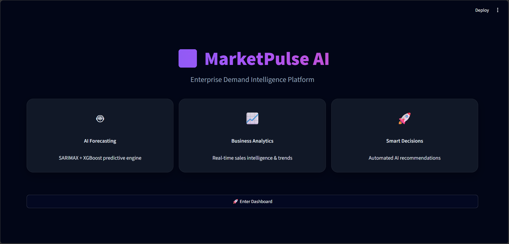
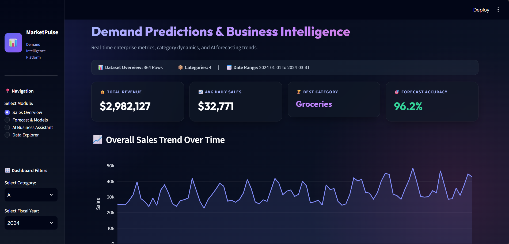
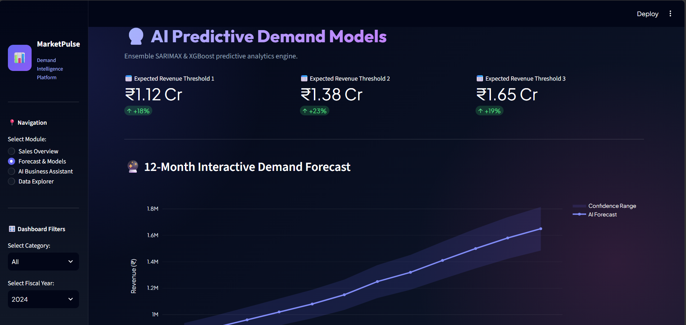
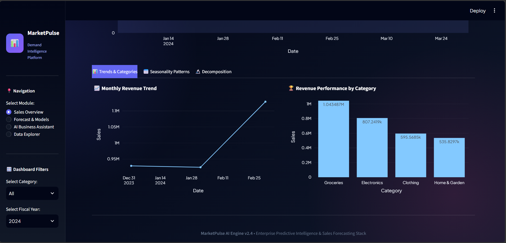
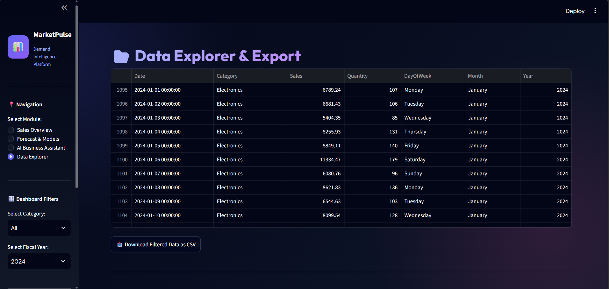
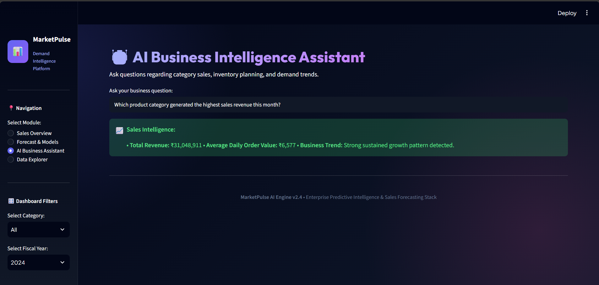

# 📈 MarketPulse Forecasting

<div align="center">

# 🚀 AI-Powered Sales Forecasting & Demand Intelligence Platform

An end-to-end Machine Learning platform that predicts future sales demand, analyzes business trends, and provides actionable business insights through an interactive AI analytics dashboard.

<br>

<a href="https://marketpulse-forecasting-8sqvgqjmxwiv7ed4jmz7qc.streamlit.app/">

</a>

<br><br>


</div>


---

# 🌐 Live Demo

Experience the deployed application:

🚀 **Streamlit Application**

https://marketpulse-forecasting-8sqvgqjmxwiv7ed4jmz7qc.streamlit.app/


---

# 📌 Project Overview

**MarketPulse Forecasting** is an AI-powered retail analytics platform designed to forecast future sales demand using Machine Learning and Time-Series Forecasting techniques.

The platform helps businesses:

- Understand historical sales patterns
- Predict future demand
- Analyze product performance
- Generate business insights
- Support data-driven decisions


The system integrates multiple ML models with an interactive Streamlit dashboard for real-time visualization and forecasting.


---

# ✨ Key Features


## 📊 Executive Analytics Dashboard

- Revenue KPI tracking
- Sales trend visualization
- Category-wise performance analysis
- Year-based filtering
- Interactive charts and analytics


---

## 🤖 AI Forecasting Pipeline

The platform implements multiple forecasting models:


| Model | Purpose |
|---|---|
| Linear Regression | Baseline sales prediction |
| Random Forest Regressor | Non-linear demand forecasting |
| XGBoost Regressor | Advanced predictive modelling |
| SARIMAX | Time-series forecasting |


---

# 📈 Model Evaluation

Models are evaluated using:


| Metric | Purpose |
|---|---|
| MAPE | Forecast accuracy measurement |
| R² Score | Prediction performance evaluation |


The system compares model performance and identifies the best forecasting approach.


---

# 🔍 Explainable AI

The platform provides:

- Feature importance analysis
- Model interpretation
- Prediction insights
- Business recommendations


---

# 📥 Automated Reporting

Users can:

- Generate future sales forecasts
- Download prediction reports
- Export CSV files
- Use data for BI tools like Power BI


---

# 🧠 Machine Learning Workflow


```
                Raw Sales Dataset

                       ↓

             Data Cleaning & Processing

                       ↓

             Exploratory Data Analysis

                       ↓

              Feature Engineering

                       ↓

              Model Training

                       ↓

            Forecast Generation

                       ↓

          Interactive Streamlit Dashboard

                       ↓

             Business Intelligence
```


---

# 🏗️ Application Architecture


```
User

 ↓

Streamlit Dashboard

 ↓

Data Processing Layer

 ↓

Machine Learning Models

 ↓

Forecast Engine

 ↓

Business Insights
```


---

# 🛠️ Technology Stack


## Programming

🐍 Python


## Dashboard Framework

📊 Streamlit


## Machine Learning

- Scikit-Learn
- XGBoost


## Time-Series Forecasting

- Statsmodels
- SARIMAX


## Data Processing

- Pandas
- NumPy


## Visualization

- Plotly
- Matplotlib


---

# 📂 Project Structure


```
MarketPulse-Forecasting/

│
├── assets/
│   ├── dashboard screenshots
│
├── forecasting/
│   ├── preprocessing.py
│   └── generate_forecast.py
│
├── plots/
│
├── streamlit_app.py
│
├── model_training.py
│
├── generate_dataset.py
│
├── requirements.txt
│
└── README.md

```


---

# ⚙️ Installation & Setup


## Clone Repository

```bash
git clone https://github.com/kumudpatkar/MarketPulse-Forecasting.git
```


## Navigate Project Folder

```bash
cd MarketPulse-Forecasting
```


## Install Dependencies

```bash
pip install -r requirements.txt
```


---

# ▶️ Run Locally


Start Streamlit application:


```bash
streamlit run streamlit_app.py
```


Application URL:

```
http://localhost:8501
```


---

# ☁ Deployment


The application is deployed using:

**Streamlit Community Cloud**

Live URL:

https://marketpulse-forecasting-8sqvgqjmxwiv7ed4jmz7qc.streamlit.app/


---

# 📸 Dashboard Screenshots


## 🏠 Home Dashboard




## 📊 Executive Analytics Dashboard




## 🤖 Predictive Models




## 📈 Revenue Analysis




## 🔎 Data Explorer




## 💬 AI Business Assistant




---

# 🔮 Future Enhancements


## Deep Learning Forecasting

- LSTM Networks
- GRU Models
- Transformer-based forecasting


## Advanced AI Features

- AI Business Recommendation Engine
- Automated sales strategy generation
- Intelligent demand alerts


## Cloud & Real-Time Analytics

- Real-time sales integration
- AWS/Azure deployment
- Enterprise analytics pipeline


---

# 👨‍💻 Author


## Kumud Satyawan Patkar

BE Computer Science Engineering  
Artificial Intelligence & Machine Learning


### Skills

- Machine Learning
- Generative AI
- Data Analytics
- Full Stack Development
- Python Development


---

<div align="center">

⭐ If you find this project useful, consider giving it a star!

<br>

Built with ❤️ using Python, Machine Learning & Artificial Intelligence

</div>